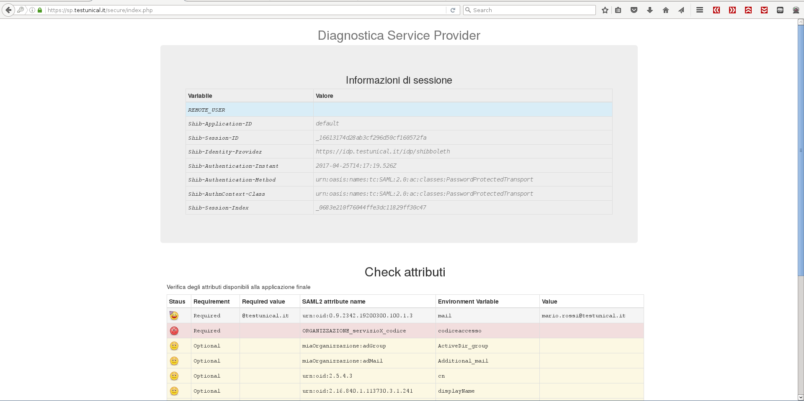

Shibboleth Ansible Debian 8 playbook
===============================

Playbok Ansible per installare e configurare un setup esemplificativo di ShibbolethIdP 3 e Shibboleth SP 2.
IdP e SP sono in esecuzione sul medesimo server ma su interfacce di rete differenti.
I servizi configurati da questo playbook sono:

- tomcat7 o tomcat8
- slapd
- apache2
- mod_shib2 (Service provider)
- shibboleth (Identity provider)
- mysql

Funzionalità:

- Possibilità di configurare il dominio (non più soltanto example.org)
- Configurazione dinamizzata

Todo

- Scelta tra Apache e Nginx/FastCGI come webserver (per sp)
- Scelta tra Tomcat7 e Jetty come contenitore servlet (per idp)
- schema migrations per DB e LDAP
- logrotate setup per le directory di logging
- configurazione slapd per storage contenuti su RDBMS
- Implementare multiple sources per attributi da RDBMS differenti

Per utilizzare questo playbook basta installare ansible in ambiente python2
    
    aptitude install python-pip python-dev libffi-dev libssl-dev libxml2-dev libxslt1-dev libjpeg8-dev zlib1g-dev
    pip2 install ansible

Se l'installazione di ansible via pip produce errori sulla configurazione delle dipendenze (pyyaml, pycrypto, libffi) è inutile fare --upgrade perchè questo non influenza le dipendenze, piuttosto bisogna rimuovere queste e reinstallare ansible. Esempio:
    
    pip2 uninstall pycrypto
    pip2 install ansible --upgrade

Comandi di deployment e cleanup
===============================

Creazione delle chiavi firmate:
    
    # installa easy-rsa
    aptitude install easy-rsa
    cp -Rp /usr/share/easy-rsa/ .
    cd easy-rsa

    # personalizziamo attributi, lunghezza DH, percorso di salvataggio delle chiavi, sopratutto data di scadenza di queste
    nano vars

    # activate environment
    source vars

    # purge all the previous keys/dh/crts
    ./clean-all

    # creates: ca.crt	ca.key	index.txt serial
    ./build-ca

    # creates diffie hellman's 
    # il tempo di creazione varia dalla lunghezza del dh, 4096bit prende qualche minuto in più
    ./build-dh

    # then creates client certificates
    ./build-key idp.example.org
    ./build-key sp.example.org
    
    # adesso nella directory "keys" troviamo le chiavi
    # da spostare in $shibboleth-Idp3-ansible/roles/common/files/$nome_dominio
    # rinominando
    cp keys/ca.crt $shibboleth-Idp3-ansible/roles/common/files/$nome_dominio/cacert.pem
    cp keys/ca.key $shibboleth-Idp3-ansible/roles/common/files/$nome_dominio/cakey.pem
    cp keys/idp.$nome_dominio.crt $shibboleth-Idp3-ansible/roles/common/files/$nome_dominio/$nome_dominio-cert.pem
    cp keys/idp.$nome_dominio.key $shibboleth-Idp3-ansible/roles/common/files/$nome_dominio/$nome_dominio-key.pem    
    cp keys/sp.$nome_dominio.key $shibboleth-Idp3-ansible/roles/common/files/$nome_dominio/$nome_dominio-key.pem
    cp keys/sp.$nome_dominio.crt $shibboleth-Idp3-ansible/roles/common/files/$nome_dominio/$nome_dominio-cert.pem

Edita le variabili nel playbook e il file hosts prima di fare l'esecuzione
    
    ansible-playbook playbook.yml -i hosts -v

Se cambi parametri puoi fare un cleanup. 
Questo è altamente sconsigliato in ambienti di produzione perchè disinstalla i software e rimuove brutalmente il contenuto delle directory di configurazione.

    ansible-playbook playbook.yml -i hosts -v --limit idp -e '{ cleanup: true }'

Ricorda di aggiungere gli hostname di idp e sp nel tuo /etc/hosts

Risultato
========================

Note
========================

La VM bisogna che abbia almeno due interfacce di rete, una per l'idp e un'altra per l'sp. Puoi usare configurazioni Vagrant oppure configurarne una manualmente in virtualbox.

Bisogna inoltre creare un utente, nella VM, che acceda in ssh tramite certificati (senza password) e ottenga privilegi di root tramite sudo senza password.

Per copiare i certificati ssh del tuo utente sulla VM puoi seguire il seguente di esempio:

    ssh-keygen -t rsa
    ssh-copy-id 10.0.3.32

Crea nel tuo DNS o in /etc/hosts gli hostname idp ed sp se sei in testunical

    10.0.3.22  idp.testunical.it
    10.0.4.22  sp.testunical.it

Gli utenti creati in slapd sono definiti in
    
    roles/slapd/templates/direcory-content.ldif

E' necessario configurare gli hostname in /etc/hosts o utilizzare un nameserver dedicato per accedere al servizio HTTPS
    
    https://sp.testunical.it

Miglioramenti
========================

Velocizzare avvio/riavvio Tomcat8, fonte: https://idem.garr.it/documenti/doc_download/489-ita-eng-guida-installazione-shibboleth-idp-v3-2-1-su-ubuntu-linux-16-04, pagina 12, capitolo 9.
  
Copiare l'output di
    
    ls /opt/shibboleth-idp/webapp/WEB-INF/lib | awk '{print $1",\\"}'
  
a seguito di
    
    tomcat.util.scan.StandardJarScanFilter.jarsToSkip=\
      
all'interno del file 
    
    /etc/tomcat8/catalina.properties

Disabilitare SAML 1 (stessa fonte del precedente) - questo e le seguenti indicazioni di Marco Malavolti sono state implementate nel playbook con il commit del "27 Apr 2017"
    
    sed -i 's/<IDPSSODescriptor protocolSupportEnumeration="urn:oasis:names:tc:SAML:2.0:protocol urn:oasis:names:tc:SAML:1.1:protocol urn:mace:shibboleth:1.0">/<IDPSSODescriptor protocolSupportEnumeration="urn:oasis:names:tc:SAML:2.0:protocol">/' /opt/shibboleth-idp/metadata/idp-metadata.xml 
    sed -i 's|<ArtifactResolutionService Binding="urn:oasis:names:tc:SAML:1.0:bindings:SOAP-binding" Location="https://idp.testunical.it:8443/idp/profile/SAML1/SOAP/ArtifactResolution" index="1"/>||' /opt/shibboleth-idp/metadata/idp-metadata.xml 
    sed -i 's|/idp/profile/SAML2/SOAP/ArtifactResolution" index="2"|/idp/profile/SAML2/SOAP/ArtifactResolution" index="1"|' /opt/shibboleth-idp/metadata/idp-metadata.xml

	
Ringraziamenti
========================

Ispirato da Garr Netvolution 2017 (http://eventi.garr.it/it/ws17) e basato sul lavoro di Davide Vaghetti https://github.com/daserzw/IdP3-ansible.

Un ringraziamento speciale a Marco Malavolti per la redazione delle guide di installazione ufficiali (e per le repository!)

Troubleshooting
========================

slapd: (error:80)

    restart slapd in debug mode
    slapd -h ldapi:/// -u openldap -g openldap -d 65 -F /etc/ldap/slapd.d/ -d 65    
    controllare che i file pem non siano vuoti e che i permessi di lettura consentano openldap+r
    per forzare in caso di certificati problematici utilizzare "directory-config_nocert.ldif"
    la connessione tra shibboleth e idp avviene in locale, in questo setup

slapd: ldap_modify: No such object (32): 

    probabilmente stai tentando di modificare qualcosa che non esiste
    Probabilmente il tipo di database se hdb, mdb o altro (dpkg-reconfigure slapd per modificarlo).
    Verificare la corrispondenza tra la configurazione di slapd e il file directory-config

"Request failed: <urlopen error ('_ssl.c:565: The handshake operation timed out',)>"

    TASK [mod-shib2 : Add IdP Metadata to Shibboleth SP]
    libapache2-mod-shib2 non contiene i file di configurazione in /etc/shibboleth (stranezza apparsa su una jessie 8.0 aggiornata a 8.7). 
    Verificare la presenza di questi altrimenti ripopolare la directory

Test confgurazioni singoli servizi/demoni

    xmlwf -e UTF-8 /etc/tomcat8/$nomefile.xml
    apache2ctl configtest
    shibd -t
    

opensaml::SecurityPolicyException
Message was signed, but signature could not be verified.
L'SP ha i metadati dell'IDP errati/disallineati.
		
	cd /etc/shibboleth/metadata
	wget --no-check-certificate https://idp.testunical.it/idp/shibboleth
	# verificare che siano effettivamente differenti !
	diff shibboleth idp.testunical.it-metadata.xml 
	rm idp.testunical.it-metadata.xml 
	mv shibboleth idp.testunical.it-metadata.xml 
	# nessun riavvio è richiesto

Altri comandi
========================

Esecuzione di un solo role
    
    ansible-playbook playbook.yml -i hosts --tag common

Esecuzione selettiva, quei roles limitati ai nodi idp
    
    ansible-playbook playbook.yml -i hosts -v --tag tomcat7,slapd --limit idp
    
Esecuzione selettiva, quei roles limitati a quel target

    ansible-playbook playbook.yml -i hosts -v --tag tomcat7,slapd --extra-vars "target=idp"

Setup di Shibboleth Idp3
    
    ansible-playbook playbook.yml -i hosts -v --tag shib3idp --limit idp 

    
